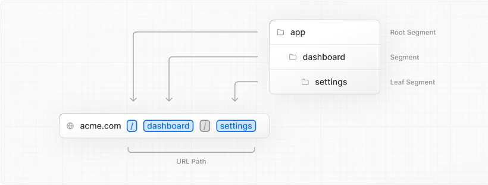
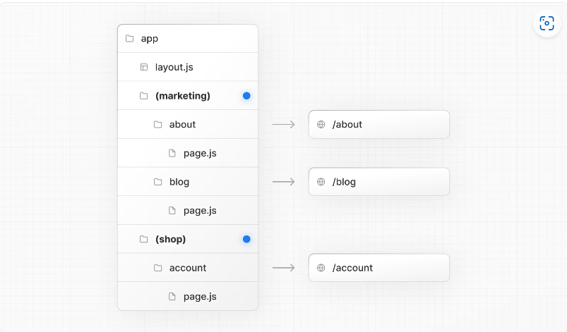
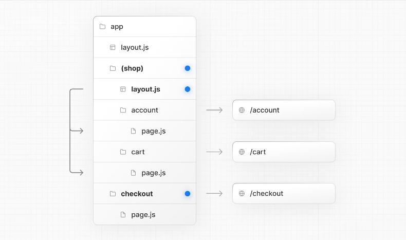
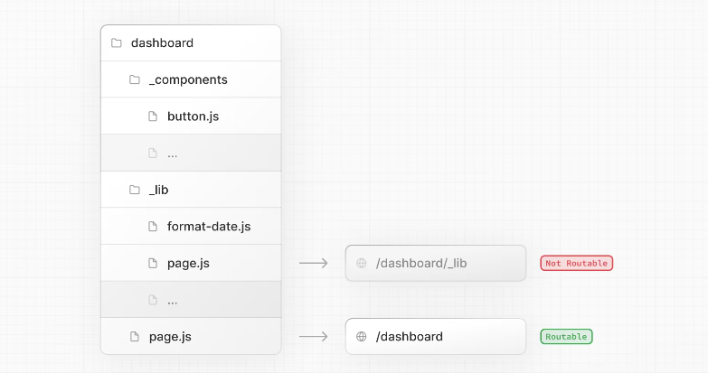
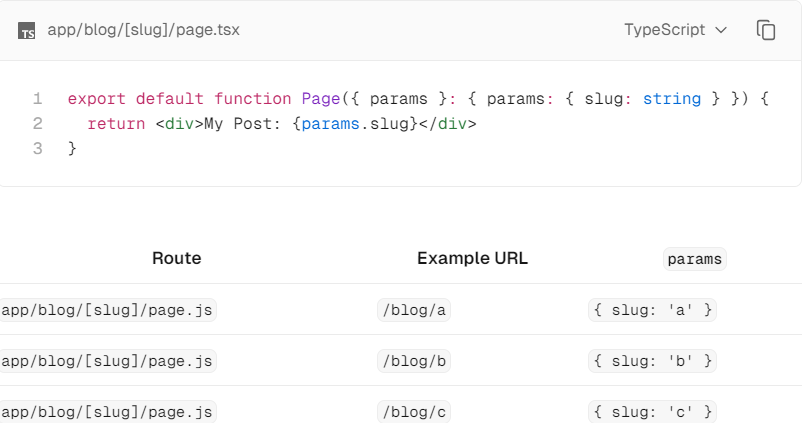
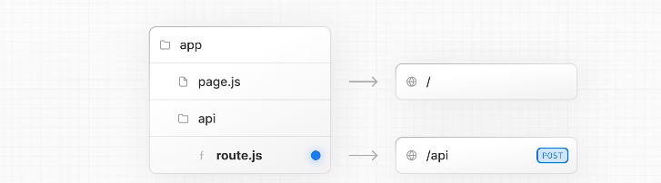

### NextJS参考

- [公式ドキュメント](https://nextjs.org/docs)
- [ミドルウェアの分割方法](https://qiita.com/masakinihirota/items/c84daec1a48ee0a02199)
- [サーバーアクションとルートハンドラーの使い分け](https://zenn.dev/coconala/articles/82a805fa39e76b)

### ルーティング

**URLセグメント**スラッシュで区切られたURLパスの一部。

**規則**

 - フォルダ構成でURLがきまる。(フォルダ構成にないURLをたたくとNot Found画面として表示される)

 - ファイル名は下記ルールで名前と機能が決まっている(それ以外のファイル名だとコンパイルエラーにはならないがNot Found画面として表示される)

  |ファイル名|意味|
  |:--|:--|
  |layout|そのディレクトリおよびネストされたすべてのページに適用される共通のレイアウト。同じ階層のページファイルや子階層以降のレイアウト、ページファイルを入れ子にできる|
  |page|そのディレクトリのルートに対応するページコンポーネント|
  |loading|ロードされている際に表示されるUI。あまりカスタマイズすることはない|
  |not-found|ページが見つからなかったときに表示されるUI。あまりカスタマイズすることはない|
  |error|エラーが発生したときに表示されるUI|
  |route|APIルートやサーバー側のロジックを定義するために使用.app/api/ディレクトリ内で使用|
  |template|異なるページ間での状態を独立させたい場合に使用|

**画面遷移方法**

 - Linkタグを使って遷移。動的にリンクを制御したり、プリフェッチの制御も可能
 - useRouterフックを利用して遷移(クライアントコンポーネントの場合のみ)
 - redirect関数を利用して遷移(サーバーコンポーネントの場合のみ)※Nextjsはデフォルトでサーバーコンポーネントのため多様

**仕組み**
 
 - **コード分割**
   - URLのパスごとに必要なコードだけを分けて管理
   - アクセスしたときに該当するコードのみ読み込ませる
   - → ユーザーが訪れているページに関連するコードだけが読み込まれるため、無駄なデータの転送が減り、アプリケーションが素早く動作するようになる
 - **プリフェッチ**:アクセスする前にあらかじめ必要なデータやコードをバックグラウンドで読み込む→遷移したときの表示が早くなる
 - **キャッシング**:読み込んだデータをブラウザの一時メモリに保存しておくことで速度向上が得られる

 - **ルートグループ**
   - フォルダーの名前をかっこで囲むことで作成できる
     
   - フォルダがルートの URL パスに含まれないようにすることができる
   - URL パス構造に影響を与えることなく、論理グループに整理できる
   - ルートレイアウトを複数持たせることもできる
     
    
  - **プライベートフォルダ**
    - フォルダの名前の戦闘にアンダーバーをつけることで作成できる
    - フォルダーとそのすべてのサブフォルダーをルーティングから除外する
    　

  - **動的ルート**
    - フォルダー名を角括弧で囲むことで作成できる
    - 動的セグメントはlayout、page、route、およびgenerateMetadata関数にparamsプロパティとして渡される。
      

  - **並列ルート**
    - 同じレイアウト内の 1 つ以上のページを同時にまたは条件付きでレンダリングできる
    - フォルダ名の前に@マークをつけることで作成できる
    - 注意点
      - @フォルダ名と一致しないと表示されない
      - 親フォルダからは参照できない
      - 子画面はデフォルト画面になる
  
  - **ルートハンドラー**
    - Webを使用して特定のルートのカスタムリクエストハンドラを作成できる
      
    - レイアウトやクライアント側のナビゲーションには関与しない
    - ルートハンドラーとページを同じルートにが存在することはできない
      - apiフォルダ配下ならOK
    - default exportで書くとエラー
    - ルートハンドラはデフォルトではキャッシュされないがGETメソッドに関してはキャッシュを設定できる
    
  - **ミドルウェア**
    - 適切なユースケース
      - 認証と承認(: 特定のページまたは API ルートへのアクセスを許可する前に、ユーザー ID を確認し、セッション Cookie を確認)
      - サーバーサイドリダイレクト(特定の条件(ロケール、ユーザーロールなど)に基づいてサーバーレベルでユーザーをリダイレクト)
      - パスの書き換え: リクエストのプロパティに基づいて API ルートまたはページにパスを動的に書き換えることで、A/B テスト、機能のロールアウト、または従来のパスをサポート
      - ボット検出:ボットトラフィックを検出してブロックすることで、リソースを保護
      - ログ記録と分析: ページまたは API で処理する前に、要求データを取得して分析し、分析情報を取得
      - 機能フラグ設定: シームレスな機能のロールアウトまたはテストのために、機能を動的に有効または無効
    - 不適切なユースケース
      - 複雑なデータの取得と操作: ミドルウェアは直接的なデータの取得や操作用には設計されていない
      - 負荷の高い計算タスク: ミドルウェアは軽量で迅速に応答する必要があり、そうしないとページの読み込みが遅延する可能性がある
      - 広範なセッション管理: ミドルウェアは基本的なセッション タスクを管理できるが、広範なセッション管理まではカバーできない
      - 直接データベース操作: ミドルウェア内で直接データベース操作を実行することはお薦めしていない

