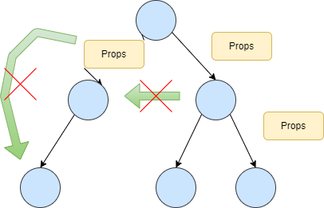

# React

[React Document](https://ja.react.dev/reference/react)

## コンポーネント

### コンポーネントとは

<details><summary>説明</summary>


 - **コンポーネント:UI(ユーザーインターフェース)を構成する再利用可能な部品やモジュール**
   - 再利用性の向上:一度作成したコンポーネントはほかの場所でも使いまわせる
   - 管理容易性の向上:小さな単位でファイルを分割するためコード管理の負荷が下がる
   - 独立性の向上:ほかのコンポーネントへの影響を抑えれるためバグを減らせる

</details>

### コンポーネントの定義

<details><summary>説明</summary>

宣言時(関数コンポーネント)
```jsx
//ルール2:関数を定義する(function,アロー関数)
const Component = () => {
    //ルール4:JSXをリターンする
    return (
        //ルール3:マークアップを加える
        <>
            <div>Hello</div>
        </>
    )
}

//ルール1エクスポートする
export default Component;
```
 - 注意点
   - 関数名を大文字にしないとエラーになる
   - エクスポートしないとほかのファイルからコンポーネントを利用できない
   - ()をつかわないとreturn分の後ろにあるコードはすべて無視されるためreturn行と同じ行にならない場合は()を用いる
   - コンポーネントの定義をコンポーネント内で行わないこと

実行時
```jsx
<Component />
```

</details>

### JSX

<details><summary>説明</summary>

 - **JSX**:JavaScript内でHTMLのような構文を使ってユーザーインターフェースを記述するための拡張構文
   - ロジックと画面が同じ個所にあるためJSに慣れている人にとっては直感的に記述できる
   - JavaScriptの構文をJSX内でほぼ自由に使用できる

 - ルール
   - コンポーネントから複数の要素を返すには、それを単一の親タグで囲む
     - マークアップに余分なdivタグを加えたくない場合は代わりに(<></>)を使う(フラグメント)
     - jsxは内部でオブジェクトに変換される。オブジェクトは同時に2つも返せないため親のオブジェクトでラップするイメージ
   - キャメルケースで記述する
   - 「{}」をつかうことで中にJavaScriptを埋め込むことができる

[コンバータ](https://transform.tools/html-to-jsx) の活用でJSXを記述する
   
</details>

### Props

<details><summary>説明</summary>

 - **コンポーネントにデータを渡すための手段**
   - 同じコンポーネントに異なる値を渡すことで再利用性が向上する

親コンポーネント
```jsx
//パターン1(パラメータとして渡す)
const ParentComponent = () => {
    return (
        <>
            <ChildComponent param1="値1" param2="値2">
        </>
    )
}
```
```jsx
//パターン2(スプレッド演算子を利用して渡す)
const ParentComponent = () => {
    params = {param1:"値1",param2:"値2"}
    return (
        <>
            <ChildComponent {...params}>
        </>
    )
}
```

子コンポーネント
```jsx
//パターン1(一つのオブジェクトとして受け取る)
const ChildComponent = ( props ) => {
    return (
        <>
            <ChildComponent>
        </>
    )
}
```
```jsx
//パターン2(分割代入として受け取る)
const ChildComponent = ( param1, param2 ) => {
    return (
        <>
            <ChildComponent>
        </>
    )
}
```

 - ルール
   - propsの流れは一方通行(親から子へのデータは渡せるが、子から親へのデータは渡せない)
   - propsは読み取り専用(propsの中身を変更できない)

</details>

## イベントリスナと状態管理

### イベントリスナに関して

<details><summary>説明</summary>

```jsx

const Component = () => {
    //イベント関数
    const 関数 = () => { return 戻り値 }

    return (
        <>
          {/*イベント実行時に関数が実行される*/}
          <div イベントタイプ={関数}></div>

          {/*描画時に関数の結果が実行される*/}
          <div イベントタイプ={関数()}></div>

          {/*通常関数をイベントで実行させたい場合はアロー関数の形式にする*/}
          <div イベントタイプ={() => 関数()}></div>

          {/*イベントから引数を受け取る*/}
          <div イベントタイプ={(e) => { e.target.value }}></div>
        </>
    )
}
```

|イベント|意味|
|:--|:--|
|onClick|クリックしたとき|
|onChange|入力を検知した|
|onBlur|フォーカスが外れたとき|
|onFocus|フォーカスした|
|onMouseEnter|ホバーしたとき|
|onMouseLeave|ホバーしなくなったとき|

</details>

### 状態管理

<details><summary>説明</summary>

```jsx
//例:入力した内容をテキストボックスに反映させる
const Component = () => {
    //1,入力した内容を保持する変数を用意
    let displayVal;

    return (
        <>
          {/*3,2でセットした値が反映される*/}
          <div>{displayVal}</div>
          <input onChange={(e) => { 
            //2,入力時にイベントから受け取った入力内容を変数に設定
            displayVal = e.target.value 
            }}>クリック</input>
        </>
    )
}
```

 - 上記コードの問題点
   - 1,onChangeイベントで実行されるコードはコールバック関数内の処理だけであり,ほかの「{}」の箇所には反映されない
   - 2,1を解決するには関数コンポーネント自体を再実行しないといけない
   - 3,ただ2の解決のため再実行すると、変数が初期化されるため値が保持できない

→関数コンポーネントを再実行(再レンダリング)する際に変更した変数をどこかに保持しておく必要がある

**useState**


```jsx
import { useState } from "react";

const Component = () => {

    const [状態変数, 更新用関数] = useState("初期値");

    return (
        <>
          <div>{状態変数}</div>
          <button イベントタイプ={(e) => { 更新用関数(e.target.value)}}>クリック</button>
        </>
    )
}
```

 - 注意点
   - コンポーネントの外では使用できない
   - コンポーネント内でもトップレベルでしか使用できない(例えばif分の中だと使用できない)
   - ステートはローディング時に設定()されるためステートを再利用する場合は更新用関数内の引数にラムダ式で受け取る
   - オブジェクト型(オブジェクト、配列)を扱う場合、更新用関数に渡す引数は初期値と同じ構造にする.
   - オブジェクト型は(スプレッド演算子などで)新しいオブジェクトや配列を生成してから渡す

**State(状態):コンポーネント毎に保持される値**


 - ※コンポーネント内に定義した普通の変数はレンダリングのたびに初期化され、保持されない
 - divなどのHTML要素には紐づかない

**Stateとコンポーネントの関係**


</details>

## useEffectとカスタムフック

### useEffect

<details><summary>説明</summary>

```jsx
import { useState } from "react";
//例:タイマー
const Component = () => {
    const [time, setTime] = useState(0);

    //1秒ごとに実行
    window.setInterval(() => {
        setTime(prev => prev + 1);
    },1000)

    return (
        <>
          <time>{time}<time>
          <span>秒経過</span>
        </>
    )
}
```

 - 上記コードの問題点
   - 1,1秒経過するとsetTimeが実行される
   - 2,1によって再レンダリングされるがsetIntervalも実行されるためそれに伴いsetTimeがまた実行される。setTimeが実行されたことにより再レンダリングされるを繰り返す
   - 3,2のループが1秒の間に何回も実行されるので実際のプログラムより実行回数が多くなる

→関数コンポーネントが一番最初に読み込まれたときだけ、処理を実行したい

```jsx
import { useState, useEffect } from "react";
//例:タイマー
const Component = () => {
    const [state, setState] = useState(0);

    //依存配列あり→レンダリング時、更新時
    useEffect(
        //2,ロード時(mounted)
        //3,state更新時(updated)
        function update() {
            console.log("update");

            //2,state更新時(updated)
            //1,消滅時(unmounted)
            return function cleanUp() {
                console.log("update cleanUp");
            };
        },[state]);

    //依存配列なし→レンダリング時
    useEffect(
        //3,ロード時(mounted)
        function update() {
            console.log("mount");

            //2,消滅時(unmounted)
            return function cleanUp() {
                console.log("mount cleanUp");
            };
        },[]);
    
    //1,ロード時(mounted)
    //1,state更新時(updated)
    console.log("lender");

    return (
        <>
          <button onClick={() => setState((prev) => prev + 1)}>更新</button>
        </>
    )
}
```


</details>

### createPortal

<details><summary>説明</summary>

**ポータル**:ポータルの子要素を直接の親要素でなく別のDom要素にマウントすることができる

**バブリング**イベントが子要素から親要素へ伝搬すること


</details>

### useRef

<details><summary>説明</summary>


- 特徴
  - 再レンダリングされても情報が保存される
  - refの値を変更しても再レンダリングが発生しない

```jsx
import {useState, useRef } from "react";

const Casel = () => {
    const [value, setValue] = useState("");
    //①refオブジェクトを生成
    const inputRef = useRef()

    return (
        <div>
            <input 
              type="text" 
              ref={inputRef} //②refオブジェクトにあるカレントプロパティにDOM情報を保持させる
              value={value} 
              onChange={(e) => setValue(e.target.value)}>
            <button onClick>フォーカス</button>
        </div>
    )
}

```
</details>

### useReducer

<details><summary>説明</summary>

 - Reduxの影響を大きく受けている
 - 規模が大きくなるにつれて効力が強くなる

```jsx
//useStateとuseReducerの違い
import {,useReducer } from "react";

const Component = () => {

    const [state, setState] = useState(0);
    const countUp = () => {
        setState(prev => ++prev)
    }

    const [rstate, dispatch] = useReducer(prev => ++prev, 0)
    const rcountUp = () => {
        dispatch()
    }
    return (
        {/*useStateのバージョン*/}
        <div>
            <div>{state}<div>
            <button onClick={countUp}>フォーカス</button>
        </div>
    )
}

```

- useStateは初期値を最初に決め、どう更新するかは別で関数を宣言し最終的な値を更新関数に渡す
  - 状態の更新方法は利用者側に託す
  - コンポーネントで更新用の処理を保持
  - 書き方によっては更新関数を利用する際に純粋関数を保てなくなる
- useReducerは初期値と同時に更新内容もあらかじめ決めておく
  - 状態の更新方法も状態側が担当する
  - stateと一緒に更新用の処理を保持するためコードの見通しが良くなる
  - 純粋関数を保てるため単体テストが可能

</details>

### useContext

<details><summary>説明</summary>

   **プロップスのバケツリレー**:親から子へpropsを渡す際、コンポーネント間を跨いだり 兄弟コンポーネントに渡せないため中間にあるコンポーネントすべてを通さないといけない



 - 親コンポーネント
```jsx
import { createContext, useState} from "react";

export const MyContext = createContext();

const Example = () => {
    const [state, setState] = useState(0);

    return (
        <MyContext.Provider value={[state, setState] }>
            <Child />
            <OtherChild />
        </MyContext>
    )
}

```

 - 親コンポーネント
```jsx
//子コンポーネント以降にプロップスのバケツリレーを行わず状態を渡したい

import { createContext, useState} from "react";

export const MyContext = createContext();

const Example = () => {

    const [state, setState] = useContext(MyContext);

    return (
        //1,定義したコンテキストのプロバイダーに対してvalueを設定
        <MyContext.Provider value={[state, setState] }>
            <Child />
            <OtherChild />
        </MyContext>
    )
}

```
 - 子コンポーネント
```jsx
import { useContext } from "react";
//2,親でエクスポートしたコンテキストをインポート
import { MyContext} from "../Example";


const OtherChild = () => {
    //分割代入で更新関数を取得
    const [,setState] = useContext(MyContext);

    const clickHandler = (e) => {
        setState((prev) => prev + 1);
    }

    return (
        <div>
            <button onClick={clickHandler}>+</button>
            <div>{state}<div>
        </div>
    );
}

```

```jsx
const Child = () => {
    return (
        <div>
            <GrandChild />
        </div>
    );
}
```
 - 孫コンポーネント
```jsx
import { useContext } from "react";
//3,親でエクスポートしたコンテキストをインポート
import { MyContext} from "../Example";

const GrandChild = () => {
    //分割代入で状態を取得
    const [value] = useContext(MyContext);
    return (
        <div>{value}</div>
    );
}
```


</details>